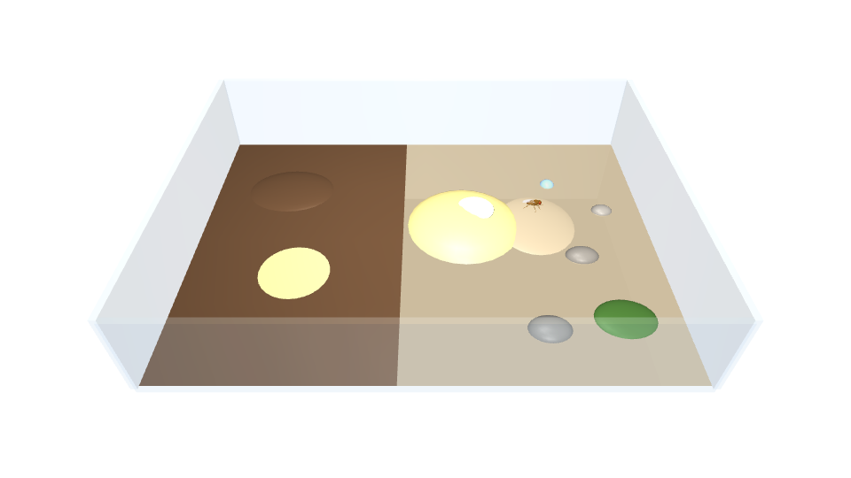

# Relatório da Fase 2: a mosca no terrário, com os sensores gerando dados (2026-09-23)

Objetivo (SPEC, Fase 2): FlyGym rodando na arena do terrário, com os sensores gerando dados.
A fase não depende do conectoma. O que liga sensores a neurônios é a Fase 3, depois da ⚠️ D-105
(`docs/D105_CONECTOMA.md`).

**Resultado: atendido.** A arena está montada em escala real, com as quatro zonas da SPEC. A mosca
NeuroMechFly anda pelo solo, sobe na fruta e passa pelo fermento, e cada órgão sensorial registra
o que toca e o que cheira. Tudo fica gravado em Parquet a 200 Hz. Testes: 17 de 17 passam.

## 1. O que foi construído

| Arquivo | Conteúdo |
|---|---|
| `configs/arena.yaml` | disposição da arena (mm): piso 80 × 60 mm, zonas, sólidos, campos |
| `terrario/world/terrarium.py` | `TerrariumWorld` (FlyGym 2.1 `BaseWorld` + `_GroundContactMixin`): piso com zonas, fruta, fermento, gotícula, 3 pedrinhas, musgo, 2 montes de relevo, paredes de vidro, luz e câmera geral; rótulo de superfície por geom e por posição |
| `terrario/world/fields.py` | odor (difusão 2D, 3 canais por fonte, regime estacionário no início), temperatura (gradiente em x), luz (ciclo dia/noite) |
| `terrario/body/sensors.py` | `FlySensors.read()` a cada 1 ms (D-006): olfato e temperatura nas antenas, gustação por órgão, forças de contato, propriocepção, pose; visão opcional |
| `terrario/body/fly.py` | `build_scene()`: corpo + mundo + ambiente + sensores |
| `terrario/body/recorder.py` | gravação a 200 Hz em Parquet (zstd), metadados no schema; protótipo do log da Fase 6 |
| `experiments/phase2_demo.py` | travessia solo → fruta → paisagem, resumo JSON, imagem da arena |
| `tests/test_world.py` | 10 testes (zonas, relevo, odor estacionário e gradientes, gustação em 5 superfícies, gravação) |

Zonas (SPEC, "O terrário"): **solo úmido** (x < −4 mm) com **colônia de bactérias** (disco de 6 mm);
**fruta** (fatia elipsoidal com ~20 mm de diâmetro no piso e topo a 2,5 mm) com **fermento** na superfície, encostada
no solo (**borda fruta–solo**); **paisagem** com pedrinhas, musgo, gotícula e relevo suave.
Cada sólido é um geom de chão com pares de contato próprios (798 pares).

## 2. Sensores (o que cada órgão entrega)

| Sentido | Dado | Origem |
|---|---|---|
| Olfato | concentração de `fruta`, `fermento`, `bacterias` em cada funículo (E/D) | campo de odor nosso (o FlyGym 2.x não tem olfato, D-002) |
| Termossensação | °C em cada antena | gradiente do ambiente |
| Gustação | superfície tocada (solo, bactérias, piso, fruta, fermento, água, pedra, musgo, vidro) e força normal, por órgão: 6 tarsos + labelo | contatos do MuJoCo por geom |
| Mecanossensação | força de contato em cada um dos 57 segmentos com contato | idem |
| Propriocepção | ângulos, velocidades e forças dos atuadores das juntas | `Simulation.get_joint_*`, `get_actuator_forces` |
| Visão (opcional) | omatídeos (2 × 721 × 2, amarelo/pálido), à taxa escolhida | `Simulation.get_ommatidia_readouts` |
| Luz | nível ambiente (dia/noite) | ambiente |

Aqui só se mede o estímulo. Converter em taxa de disparo de neurônios anotados é a Fase 3.

## 3. Validação

`uv run pytest`: **17 de 17 passam** (5 da Fase 1, 10 da Fase 2 e 2 da D-105).
- Com a mosca parada em cada zona, ≥ 4 dos 6 tarsos reportam a superfície certa (solo, bactérias,
  fruta, fermento, piso), e o labelo não toca o chão.
- O odor começa em regime estacionário: após 1 s de passos explícitos, a variação máxima é < 0,1 %.
- Gradientes: o fermento é mais forte sobre o fermento que sobre a fruta, e mais forte ali que longe
  dela; o mesmo vale para a fruta e para as bactérias.

**Travessia** (`experiments/phase2_demo.py`, 2,5 s; `results/phase2/walk_soil_fruit_landscape.json`).
Quem move as pernas é o CPG de demonstração do FlyGym, um arnês de teste NON-CONNECTOME:
- Trajeto: de (−14, 5) a (21, 8,7) mm, ~14 mm/s, subindo 2,5 mm na fruta e descendo na paisagem.
- Superfícies em sequência, por perna: `solo → piso → fruta → piso` nas 6 pernas. As pernas
  direitas dianteira e média passaram pela borda do fermento (`… fruta → fermento → fruta …`).
- Apoio (fração do tempo em contato): 0,60–0,89 por perna, marcha trípode do CPG.
- Odor médio nas antenas (u.a.), início → pico → fim: fermento 0,011 → **0,068** (sobre o
  fermento, em x = 9,2 mm) → 0,026; fruta 0,0045 → 0,015 (sobre a fruta) → 0,0071; bactérias
  0,0065 → 0,0006 (afastando-se do solo). Temperatura: 21,4 → 23,1 °C.

## 4. Custo (perfil Desempenho, na tomada, máquina ociosa)

| Configuração | s/s | Obs. |
|---|---|---|
| Chão plano do FlyGym (referência, `bench/bench_flygym.py`) | 2,25 | Fase 0: 2,31 |
| Terrário, só física, Jacobiano denso | 3,07 | +36 %: 798 pares de contato com o relevo |
| Terrário, só física, Jacobiano esparso | 2,87 | com uma mosca só, o esparso é 7 % mais rápido |
| **Terrário + sensores + ambiente + gravação (denso)** | **3,38** | física 3,22 + sensores e campos 0,15 |
| Idem + visão a 100 Hz | 7,29 | visão +4,2 s/s, como na Fase 0 |

Log: **235 kB por segundo simulado** (200 Hz, zstd), ou seja, 5 GB em ~5,9 h simuladas.
Sem o cérebro, o episódio da mosca custa ~3,4 s/s. Com o cérebro da v783 (0,68 s/s), fica em ~4 s/s.

O Jacobiano fica denso por padrão, por causa do risco medido com vários animais no mesmo
`MjModel` (CLAUDE.md). A decisão será revista na Fase 5, quando as minhocas entrarem.

## 5. Premissas e pontos para as próximas fases
1. **"Pousa na fruta" (SPEC, elenco)**: o NeuroMechFly do FlyGym 2.1 não voa. Nesta fase a mosca
   chega à fruta andando. O FlyGym 2.1 inclui o modelo FlyBody (com asas), mas não verifiquei se
   a aerodinâmica de voo vem junto. Fica registrado para quando o voo for pedido.
2. **Probóscide sem juntas** no corpo de locomoção padrão (`make_locomotion_fly`): o labelo toca
   o alimento, mas a extensão (MN9 → probóscide) exige juntas e atuadores novos na Fase 3.
3. **Odor 2D**: o mesmo valor em qualquer altura. As antenas sobre a fruta (~3 mm) leem o valor do
   plano. Se a Fase 3 pedir gradiente vertical, o campo passa a 3D (o custo atual é ~0,1 s/s).
4. O labelo e as pernas usam a mesma tabela de superfícies. A química (açúcar da fruta, fermento,
   água) e o mapeamento para GRNs/ORNs são da Fase 3, depois da D-105.

## 6. NON-CONNECTOME desta fase
Registrados em `docs/NON_CONNECTOME.md` ("Fase 2"): arena, zonas, contato da probóscide, campo de
odor, temperatura, luz, amostragem nas antenas, gustação por superfície e o CPG usado como arnês de teste.

## 7. Aprovação
Fase 2 aprovada em 2026-09-23. Na aprovação, ficou decidido que a mosca chega à fruta andando (registrado na
SPEC). D-105 = (c) e D-106 aprovadas; o plano da Fase 3 está em `docs/FASE3_PLANO.md`.
